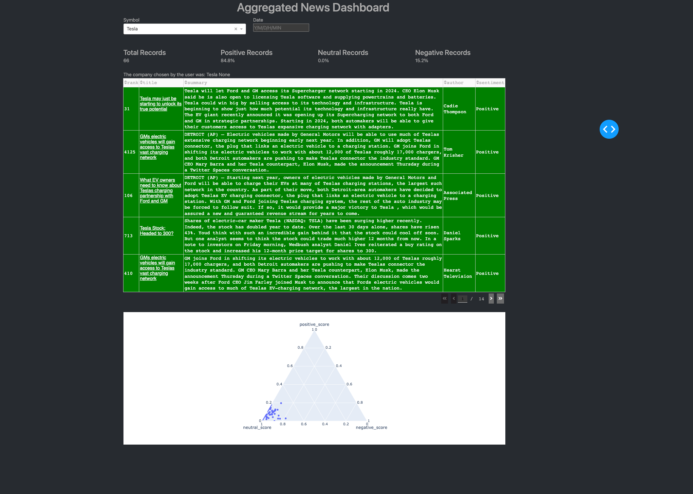

# Aggregated News Dashboard
## Powered by [newscatcher](https://newscatcherapi.com/)

## Goal
The goal of this project is to build a dashboard that aggregates news on a specific topic. The hope is to leverage sentiment analysis to quickly inform the user about the news landscape of their keyword interest in a general yet detailed manner.

## Website
Access the dashboard [here](https://twitter-sentiment-dashboard-47izcfzeyq-vp.a.run.app)

You are presented with a keyword dropdown and a date filter. After filtering the data, you are presented with 3 items: a row with KPI metrics, a table, and a ternary plot. More specifically, the KPI metrics outline the total number of records.
the percentage of records deemed to be positive, the percentage of records deemed to be neutral, and the percentage of records deemed to be negative. The table presents five rows where each row can be highlighted green, blue, or red indicating 
positive, neutral, or negative sentiment, respectively. It is important to note that the table not only incorporates sorting for each column (rank, title, summary, author, and sentiment) but also incorporates pagination if the number of
records exceeds five. The ternary plot visualizes the positive, neutral, and negative scores for each record; the lasso selector can be used to dynamically filter records presented in the table above.

## Known bugs
These bugs do not break the website, but might impact the experience:

- If a user wants to see all records for a keyword after filtering with the Lasso selector, they must refresh the page
- There are lots of redundant articles due to similar articles being published by different news sources. I'm currently working to apply a naive similarity search to remove similar articles but would like to use locality sensitivity hashing in the future
